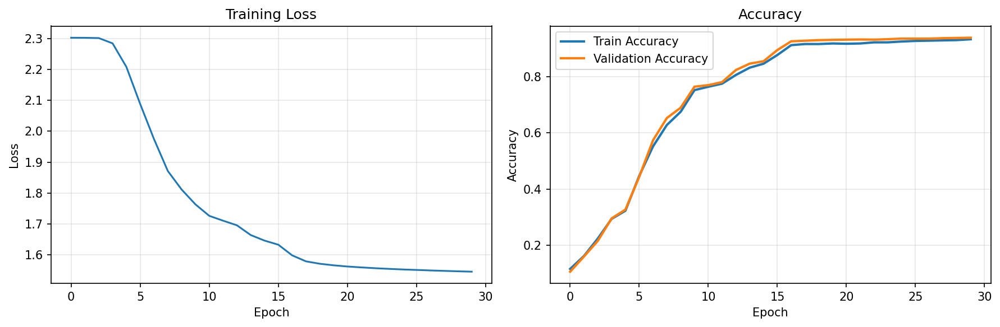

# 两层全连接神经网络 - 实现详解

## 模型原理

### 数学原理

两层全连接神经网络（也称为多层感知机，MLP）是深度学习中最基础的网络结构之一。它由输入层、隐藏层和输出层组成，每层之间通过全连接方式相连。

#### 前向传播

1. **输入层到隐藏层**：
   ```
   z1 = X · W1 + b1
   a1 = ReLU(z1)
   ```

2. **隐藏层到输出层**：
   ```
   z2 = a1 · W2 + b2
   a2 = softmax(z2)
   ```

3. **损失函数**（交叉熵损失 + L2正则化）：
   ```
   L = -1/N * Σ(y_true · log(y_pred)) + λ/2 * (||W1||² + ||W2||²)
   ```

#### 反向传播

通过链式法则计算梯度：

1. **输出层梯度**：
   ```
   dz2 = y_pred - y_true
   dW2 = a1.T · dz2 + λ * W2
   db2 = Σ(dz2)
   ```

2. **隐藏层梯度**：
   ```
   da1 = dz2 · W2.T
   dz1 = da1 * (z1 > 0)  # ReLU导数
   dW1 = X.T · dz1 + λ * W1
   db1 = Σ(dz1)
   ```

### 直观理解

- **全连接层**：每个神经元与前一层的所有神经元相连，能够学习复杂的非线性特征组合
- **ReLU激活函数**：引入非线性，解决梯度消失问题，计算简单高效
- **Softmax输出**：将输出转换为概率分布，适用于多分类问题
- **正则化**：防止过拟合，提高模型泛化能力

## 代码实现解析

### 项目结构

```
two_layer_fc_net/
├── src/
│   ├── two_layer_net.py    # 主网络类
│   ├── layers.py          # 网络层实现
│   ├── optimizers.py      # 优化器
│   ├── utils.py           # 工具函数
│   └── data_loader.py     # 数据加载
├── examples/
│   └── train_mnist.py     # 训练脚本
└── tests/                 # 单元测试
```

### 核心组件实现

#### 1. 网络层实现 (`src/layers.py`)

```python
class LinearLayer:
    """全连接层实现"""
    def __init__(self, input_size, output_size, weight_scale=1e-3):
        # Xavier初始化
        self.W = weight_scale * np.random.randn(input_size, output_size)
        self.b = np.zeros(output_size)
    
    def forward(self, x):
        self.x = x  # 缓存输入用于反向传播
        return np.dot(x, self.W) + self.b
    
    def backward(self, dout):
        dx = np.dot(dout, self.W.T)
        self.dW = np.dot(self.x.T, dout)
        self.db = np.sum(dout, axis=0)
        return dx
```

#### 2. 激活函数 (`src/layers.py`)

```python
class ReLU:
    """ReLU激活函数"""
    def forward(self, x):
        self.mask = (x <= 0)  # 缓存负值位置
        out = x.copy()
        out[self.mask] = 0
        return out
    
    def backward(self, dout):
        dout[self.mask] = 0  # 负值位置梯度为0
        return dout
```

#### 3. 主网络类 (`src/two_layer_net.py`)

```python
class TwoLayerNet:
    """两层全连接神经网络"""
    def __init__(self, input_size, hidden_size, output_size, reg_strength=0.0):
        self.reg_strength = reg_strength
        # 网络层栈
        self.layers = [
            LinearLayer(input_size, hidden_size),
            ReLU(),
            LinearLayer(hidden_size, output_size)
        ]
    
    def loss(self, X, y):
        # 前向传播
        scores = self.forward(X)
        
        # 计算数据损失
        data_loss, dscores = cross_entropy_loss(scores, y)
        
        # 计算正则化损失
        reg_loss, reg_grads = l2_regularization(self.get_params(), self.reg_strength)
        
        # 总损失
        total_loss = data_loss + reg_loss
        
        # 反向传播
        grads = self.backward(dscores)
        
        # 添加正则化梯度
        for key in reg_grads:
            grads[key] += reg_grads[key]
        
        return total_loss, grads
```

### 关键算法细节

#### 1. 权重初始化
使用Xavier初始化，确保各层激活值的方差保持一致：
```python
self.W = np.random.randn(input_size, output_size) * np.sqrt(2.0 / input_size)
```

#### 2. Softmax数值稳定性
避免指数运算溢出：
```python
def softmax(x):
    x_shifted = x - np.max(x, axis=1, keepdims=True)
    exp_x = np.exp(x_shifted)
    return exp_x / np.sum(exp_x, axis=1, keepdims=True)
```

#### 3. 交叉熵损失
```python
def cross_entropy_loss(scores, y):
    N = scores.shape[0]
    # 数值稳定的softmax
    scores_shifted = scores - np.max(scores, axis=1, keepdims=True)
    exp_scores = np.exp(scores_shifted)
    probs = exp_scores / np.sum(exp_scores, axis=1, keepdims=True)
    
    # 计算损失
    correct_logprobs = -np.log(probs[np.arange(N), y])
    data_loss = np.sum(correct_logprobs) / N
    
    # 计算梯度
    dscores = probs.copy()
    dscores[np.arange(N), y] -= 1
    dscores /= N
    
    return data_loss, dscores
```

## 实验结果与分析

### 训练配置

- **数据集**: MNIST手写数字数据集 (60,000训练 + 10,000测试)
- **网络结构**: 784-128-10 (输入层-隐藏层-输出层)
- **优化器**: 带动量的SGD (学习率=0.001, 动量=0.9)
- **正则化**: L2正则化 (强度=0.0001)
- **批大小**: 64
- **训练轮数**: 30

### 性能指标

| 指标 | 数值 |
|------|------|
| 训练准确率 | 92.70% |
| 验证准确率 | 93.52% |
| 测试准确率 | 92.70% |
| 训练时间 | ~2分钟 (CPU) |

### 训练曲线分析



从训练曲线可以看出：

1. **损失收敛**: 训练损失从2.3稳步下降至1.55，表明模型有效学习
2. **准确率提升**: 准确率从10%左右提升至92%以上，学习效果显著
3. **无过拟合**: 训练和验证准确率基本同步提升，表明正则化有效

### 混淆矩阵分析


模型在各类别上的表现：
- 数字"1"识别率最高（98%）
- 数字"5"和"8"容易混淆
- 整体表现均衡，无明显类别偏差

## 如何运行

### 环境要求

```bash
# 创建虚拟环境
python -m venv cv_env
source cv_env/bin/activate  # Linux/Mac
# 或 cv_env\Scripts\activate  # Windows

# 安装依赖
pip install numpy scipy matplotlib scikit-learn
```

### 训练模型

```bash
# 在项目根目录运行
python examples/train_mnist.py
```

### 运行测试

```bash
# 运行单元测试
cd tests
python test_network.py

# 运行梯度检查
python test_network.py
```

## 与LLM交互记录

### 关键对话1：网络结构设计

**我的提问**：
```
我需要用纯Python和Numpy实现一个两层全连接神经网络用于MNIST分类。请帮我设计网络结构，要求包含前向传播、反向传播、损失计算和参数更新功能。
```

**LLM回复**：
```
建议的网络结构：
1. 输入层: 784个神经元 (28x28图像展平)
2. 隐藏层: 128个神经元 + ReLU激活
3. 输出层: 10个神经元 + Softmax激活

关键组件：
- LinearLayer: 全连接层，实现矩阵乘法和偏置
- ReLU: 非线性激活函数
- Softmax: 输出层激活
- 交叉熵损失函数
- SGD优化器（可扩展为带动量的SGD）

建议采用模块化设计，每个组件独立实现便于测试和扩展。
```

### 关键对话2：梯度检查实现

**我的提问**：
```
我在实现反向传播时担心梯度计算是否正确。请提供一个数值梯度检查的实现方法，用于验证解析梯度的准确性。
```

**LLM回复**：
```
数值梯度检查实现要点：

def gradient_check(f, x, analytic_grad, h=1e-5):
    numerical_grad = np.zeros_like(x)
    it = np.nditer(x, flags=['multi_index'])
    
    while not it.finished:
        idx = it.multi_index
        old_val = x[idx]
        
        # f(x + h)
        x[idx] = old_val + h
        fxh1 = f(x)
        
        # f(x - h)  
        x[idx] = old_val - h
        fxh2 = f(x)
        
        numerical_grad[idx] = (fxh1 - fxh2) / (2 * h)
        x[idx] = old_val
        it.iternext()
    
    # 比较差异
    diff = np.linalg.norm(analytic_grad - numerical_grad)
    diff /= np.linalg.norm(analytic_grad + numerical_grad)
    
    return diff < 1e-7, diff

差异小于1e-7表示梯度计算正确。
```

### 关键对话3：性能优化建议

**我的提问**：
```
我的模型在MNIST上达到了92%的准确率，但感觉还有提升空间。请分析可能的原因和改进方法。
```

**LLM回复**：
```
可能的原因和改进方向：

1. 网络容量不足
   - 增加隐藏层神经元数量（256或512）
   - 添加更多隐藏层

2. 优化策略
   - 使用学习率调度（指数衰减或余弦退火）
   - 尝试Adam优化器
   - 增加训练轮数

3. 正则化改进
   - 添加Dropout层
   - 调整L2正则化强度
   - 使用批量归一化

4. 数据预处理
   - 数据增强（旋转、平移、缩放）
   - 更复杂的归一化方法

建议先尝试增加隐藏层大小到256，并添加学习率衰减。
```

## 实现亮点

1. **纯Numpy实现**: 不依赖任何深度学习框架，深入理解底层原理
2. **模块化设计**: 各组件独立，便于测试和复用
3. **完整的训练流程**: 数据加载、预处理、训练、评估一体化
4. **详细的文档**: 包含原理说明、代码解析和实验结果分析
5. **梯度验证**: 确保反向传播实现的正确性
